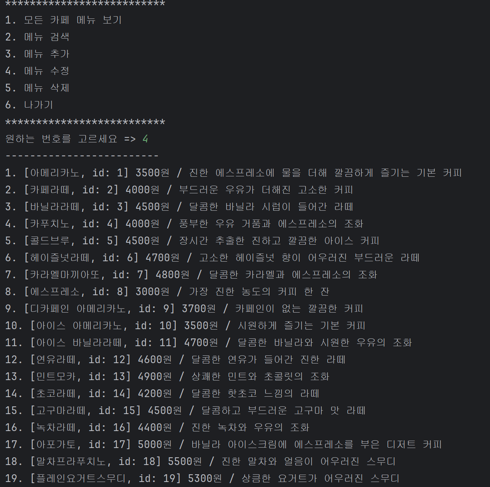
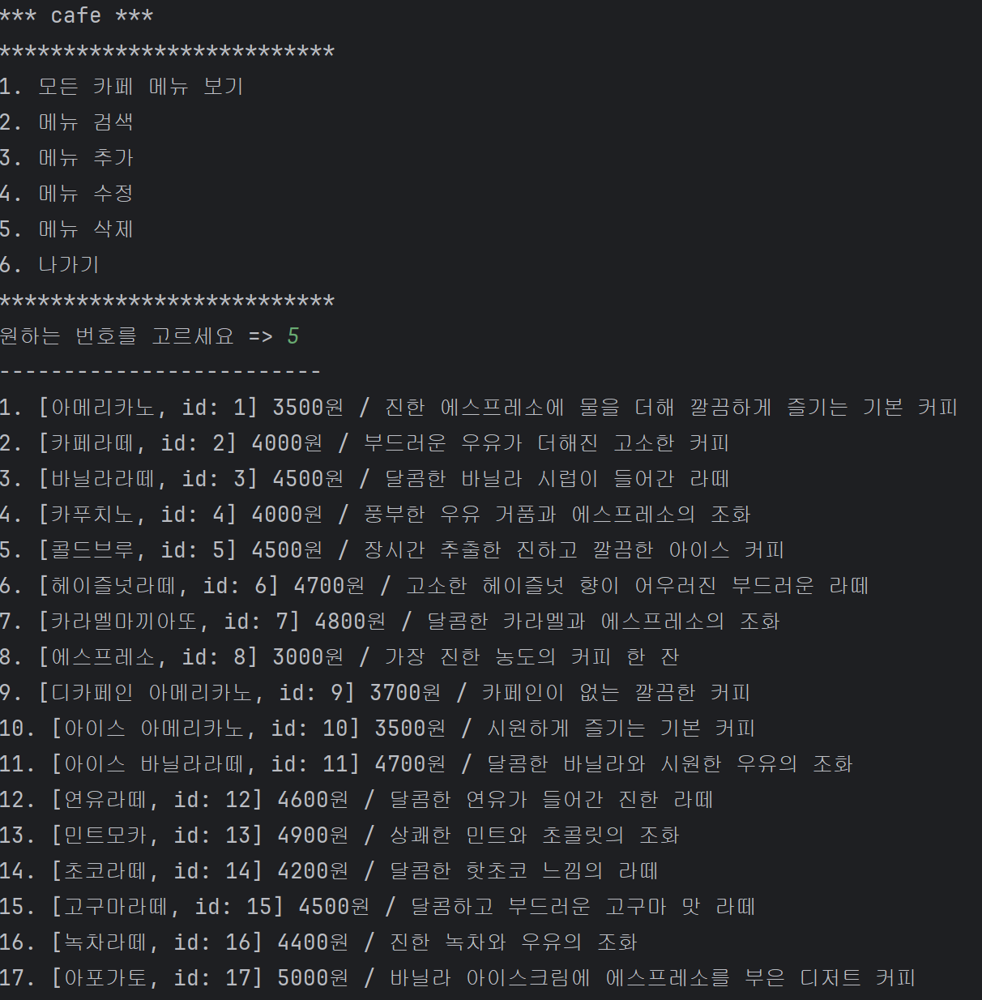

# ☕ 웹 서비스 프로젝트 1주차 과제 - 카페 메뉴판 만들기

## 📌 과제 개요

SQLite 데이터베이스와 Java를 활용하여 간단한 메뉴 관리 시스템을 구현한다.  
기본적인 CRUD 기능을 직접 구현하며, JDBC 기반의 데이터 연동과 객체지향 구조 설계를 연습한다.

---

## 🎯 주요 기능

- 전체 메뉴 목록 출력 (Read)
- 메뉴 검색 (부분 검색 포함)
- 새 메뉴 추가 (입력값 검증 포함) (Create)
- 메뉴 수정 (Update)
- 메뉴 삭제 (Delete)

---

## 🛠 기술 스택

- Java
- SQLite3
- IntelliJ IDEA
- Maven
- JDBC

---

## 📖 1주차 블로그 포스트

- [나의 첫 웹 서비스 캠프를 시작하기 전에](https://velog.io/@yo0nc/%EB%82%98%EC%9D%98-%EC%B2%AB-%EC%9B%B9-%EC%84%9C%EB%B9%84%EC%8A%A4-%EC%BA%A0%ED%94%84%EB%A5%BC-%EC%8B%9C%EC%9E%91%ED%95%98%EA%B8%B0-%EC%A0%84%EC%97%90-r5vx5uz0)
- [1주차 용어 정리](https://velog.io/@yo0nc/1%EC%A3%BC%EC%B0%A8-%EC%9A%A9%EC%96%B4-%EC%A0%95%EB%A6%AC)

---

## 🧪 테스트

### ✅ 전체 메뉴 목록 출력하기

---

### ✅ 메뉴 검색하기

  
  
  

---

### ✅ 새 메뉴 추가하기
- 이름을 입력할 때 공백을 입력하면 다시 입력하도록 처리했다.
- 가격을 음수로 입력하면 재입력을 요구한다.
- 새로운 메뉴인 페퍼민트티와 얼그레이티가 리스트에 정상적으로 추가되었다.

  
  
  

---

### ✅ 메뉴 수정하기
- 메뉴를 수정하기 전, 19번 메뉴는 ‘플레인요거트스무디’였으나
- 수정 후 ‘블루베리 스무디’로 변경된 것을 확인할 수 있다.

  
  
  

---

### ✅ 메뉴 삭제하기
- 1번 메뉴였던 ‘아메리카노’가 삭제된 것을 확인할 수 있다.

  
  

---

### ✅ 나가기
- 메뉴에서 6번을 선택하면 프로그램이 종료된다.

---

## ✅ 최종 DB 상태

- 추가된 메뉴 항목들은 `regdate`(등록일) 필드와 함께 저장된다.

